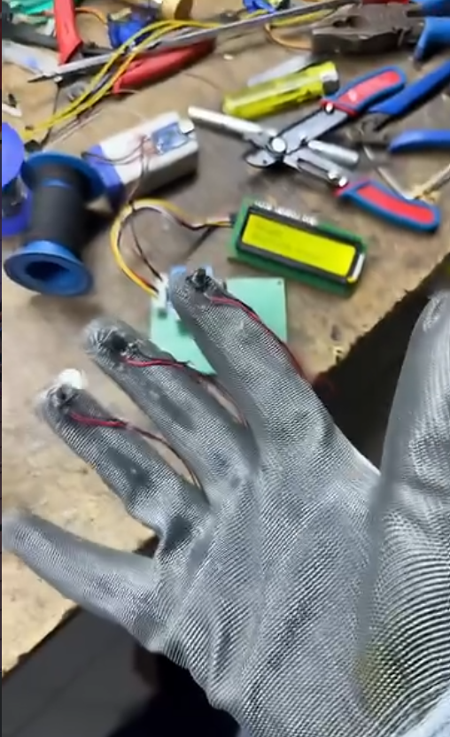

# Smart_safety_Gloves
# 🧤 Techjiku Safety Glove

> A smart emergency communication glove designed to help people quickly communicate their basic needs with a single button press

---

## 📖 Overview

The **Techjiku Safety Glove** is a wearable IoT/electronics project developed to assist individuals who may have difficulty speaking or require instant emergency communication.

The glove allows the user to send predefined messages using dedicated buttons. It is ideal for elderly people, patients, specially-abled individuals, or emergency situations.

---

## ✨ Features

- 🧤 Wearable smart glove
- 🚰 Water request button
- 🍽️ Food request button
- 🚨 Emergency assistance button
- 🔊 Audible buzzer feedback
- 📟 LCD display for message indication
- ⚡ Low power operation

---

## 🛠 Hardware Used

- Wemos D1 Mini 
- Push Buttons ×3
- 16x2 I2C LCD Display
- Active Buzzer
- Jumper Wires
- PCB
- Battery 

---

## ⚙️ Working Principle

1. The user wears the safety glove.
2. Three buttons are placed for different requests.
3. When a button is pressed:
   - The Arduino detects the input.
   - The corresponding message is displayed on the LCD.
   - The buzzer provides audible confirmation.
4. The system waits for the next command.

---

## 📋 Button Functions

| Button | Function |
|---------|----------|
| Button 1 | 💧 Water Request |
| Button 2 | 🍛 Food Request |
| Button 3 | 🚨 Emergency Alert |
